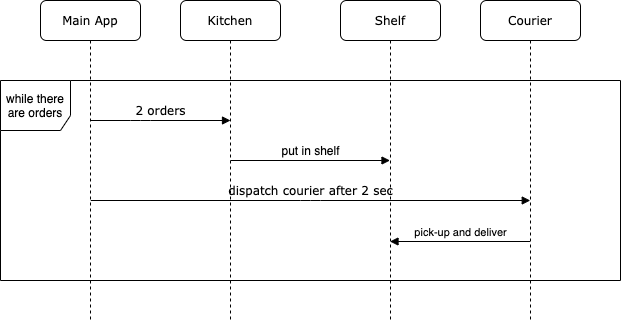

# README

### Overview
This document is both, a short design doc for the mini project given by Cloud Kitchens, and also, a how-to for running 
the delivery sim. The ask is straight-forward, to build a delivery system that emulates receiving orders and fulfills 
them by dispatching drivers to picked and deliver order.

### Design



From the above diagram we observe the main app is used to dispatch 2 signals, one goes to the kitchen where the 
configuration is set to ingest 2 orders, but can be changed in configuration.json in resources. The second signal goes
to the courier to pick-up and deliver the order.

The kitchen will be the central to control orders. The kitchen prepares order and puts them in the corresponding shelf.
In case the shelf is full, we move the oldest item in the shelf to the overflow. The assumption for this action is that
the oldest item in the shelf will be picked up faster than the one we are trying to add. For this kind of action, I went 
with a PriorityQueue making the age of the order in ascending order to remove the order on top.

### Execution
Program uses gradle to build the system. To clean and compile the code, I run the following command:
```
gradle clean; gradle build 
```

The above code generates a `build/` folder in the root directory. Inside the `build/` folder, we can find the executable.
To run the program, run the command:
```
java -jar <path_to_the_project>/build/libs/delivery_sim.jar
``` 

In case you need to make changes to the configuration, there are variables in `resources/configuration.json` that are 
used to make to make changes in the code dynamic without the need to recompile.
